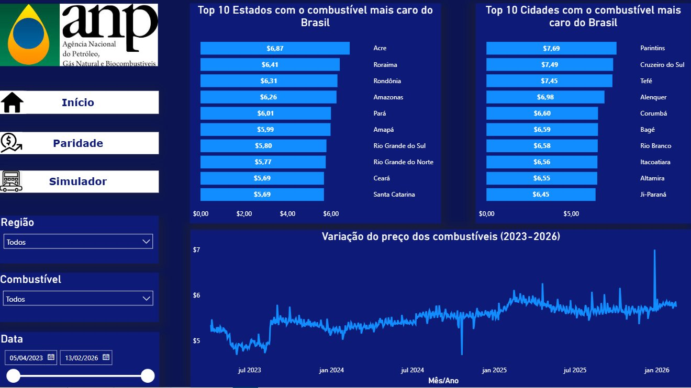
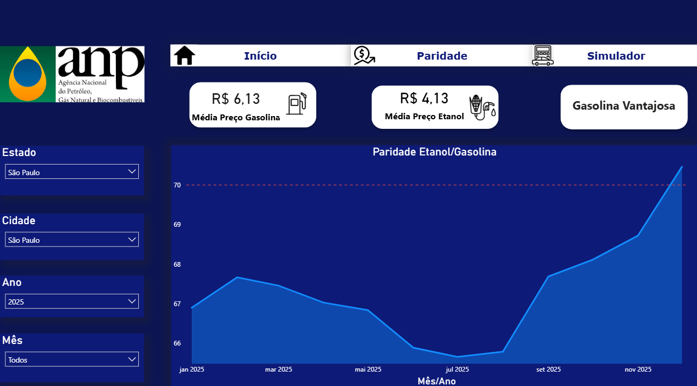
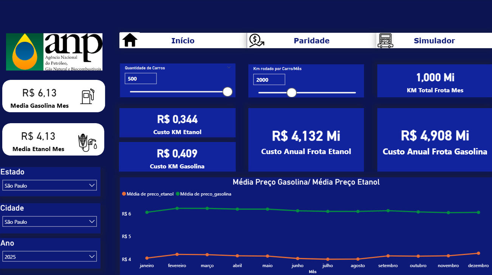

# 🛢️ Análise de Preços de Combustíveis no Brasil — ANP (2023–2026)

## 📌 Sobre o Projeto

Projeto de análise de dados desenvolvido com o objetivo de explorar 
a variação dos preços de combustíveis no Brasil utilizando dados reais 
coletados e disponibilizados pela **Agência Nacional do Petróleo, Gás 
Natural e Biocombustíveis (ANP)**.

Os dados utilizados correspondem a preços coletados em postos 
revendedores fiscalizados pela ANP em todo o território nacional, 
abrangendo o período de **abril de 2023 a fevereiro de 2026**.

---

## 🎯 Objetivo

Transformar dados brutos de fiscalização da ANP em insights acionáveis 
sobre preços de combustíveis, respondendo perguntas como:

- Quais estados e cidades possuem os combustíveis mais caros do Brasil?
- Como os preços de gasolina e etanol variaram ao longo do tempo?
- Em quais regiões o etanol é financeiramente mais vantajoso que a gasolina?
- Quanto uma empresa com frota de veículos flex pode economizar 
  escolhendo o combustível certo?

---

## 🗂️ Páginas do Dashboard

### 🏠 Início
- Top 10 estados com combustível mais caro
- Top 10 cidades com combustível mais caro
- Variação do preço dos combustíveis (2023–2026)
- Filtros: Região, Combustível, Data

### ⚖️ Paridade
- Análise da relação preço etanol vs gasolina mês a mês
- Linha de referência em 70% — limiar de vantagem do etanol
- O que é paridade etanol/gasolina
É uma conta simples que responde: qual combustível é mais barato para rodar?
Como o etanol rende menos por litro que a gasolina, o carro precisa de mais etanol para percorrer a mesma distância. A regra geral é:

Se o preço do etanol for menor que 70% do preço da gasolina → etanol é mais barato. Se for maior que 70% → gasolina compensa mais.

Exemplo prático:
ValorGasolinaR$ 6,1370% da gasolinaR$ 4,29EtanolR$ 4,13
Como R$ 4,13 está abaixo de R$ 4,29 → o etanol compensa nesse caso.
- Cards: Média Gasolina, Média Etanol, Status de Vantagem
- Filtros: Estado, Cidade, Ano, Mês
  

### 🚗 Simulador
- Simulação de custo anual de frota com gasolina vs etanol
- Parâmetros configuráveis: quantidade de carros e km/mês
- Cards: Custo Anual Gasolina, Custo Anual Etanol, Custo KM utilizando Etanol e Custo KM utilizando Gasolina e KM rodado por frota
- Filtros: Estado, Cidade, Ano

---

## 🔄 Pipeline de Dados
ANP via Base dos Dados (BigQuery)
↓
SQL (extração e agregação)
↓
Power Query (limpeza e tipagem)
↓
DAX (medidas e cálculos)
↓
Dashboard Power BI (3 páginas)

## 🛠️ Tecnologias Utilizadas

SQL & BigQuery (Camada de Dados)
A extração e o tratamento inicial foram realizados via Google BigQuery, utilizando SQL para otimizar o volume de dados transferidos para o Power BI. As principais técnicas aplicadas foram:

CTE (Common Table Expressions): Utilizadas para organizar consultas complexas e melhorar a legibilidade (como na análise de paridade).

Agregações e Pivotagem: Transformação de linhas em colunas (CASE WHEN + GROUP BY) para comparar preços de Gasolina e Etanol lado a lado.

Lógica de Negócio em SQL: * Cálculo de Razão de Paridade (Etanol vs. Gasolina) diretamente na query.

Criação de KPIs de Margem Bruta Estimada.

Tratamento de valores nulos com COALESCE e normalização de textos com UPPER.

Joins com Diretórios: Enriquecimento dos dados brutos com tabelas de diretórios oficiais (IBGE) para obter nomes de municípios e estados.

Filtros Temporais Dinâmicos: Uso de DATE_SUB e CURRENT_DATE para garantir que o dashboard exiba sempre os últimos 2 a 3 anos de dados de forma automática.

Power Query & M (ETL e Modelagem)
No Power BI, utilizei a linguagem M para os ajustes finais de tipagem e enriquecimento regional:

Value.NativeQuery: Implementação de SQL nativo com suporte a Query Folding, garantindo que o processamento pesado ocorra no servidor do BigQuery.

Lógica Condicional: Criação de colunas personalizadas para categorização de Regiões Brasileiras (Norte, Nordeste, Sudeste, etc.).

Tipagem de Dados: Garantia de integridade para valores financeiros (Currency.Type) e datas.

Power BI (Visualização)
Construção de dashboards interativos para análise de preços de combustíveis (ANP).

## 💡 Principais Insights

- **Norte e Nordeste** concentram os estados com combustível mais caro 
  — reflexo dos custos logísticos de distribuição, privatização de refinarias e baixa capacidade local de refino
- Na cidade de São Paulo (assim como diversas outras cidades do estado de São Paulo) nos anos de 2024 e 2025, a escolha por etanol era a mais econômica para os motoristas devido a vantagem na comparação de paridade entre etanol e gasolina, isso se dá pela alta concentração de usinas produtoras de etanol no estado, assim como baixos custos logísticos de transporte do combustível.
- Uma frota de **500 veículos** rodando **2.000 km/mês** pode gerar 
  diferença de custo anual de até **R$ 1,5 milhão** entre os 
  combustíveis dependendo da região

  ## 📊 Fonte dos Dados

**Base dos Dados** — `basedosdados.br_anp_precos_combustiveis.microdados`

Dados originais da **ANP — Agência Nacional do Petróleo, Gás Natural 
e Biocombustíveis**, coletados em postos revendedores fiscalizados em 
todo o Brasil.

🔗 [Base dos Dados](https://basedosdados.org)  
🔗 [ANP](https://www.gov.br/anp)
